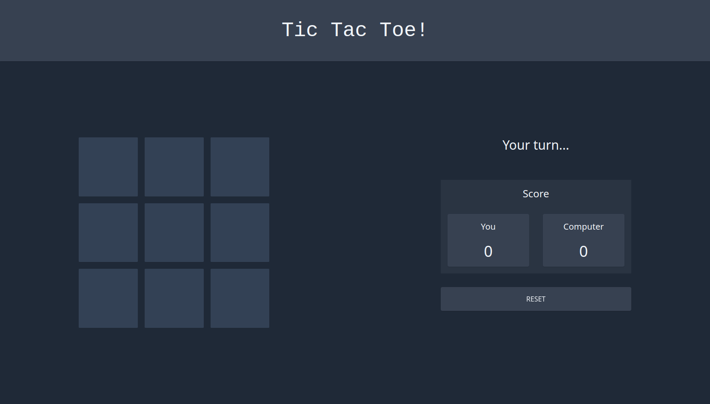

<h1 align="center">Tic Tac Toe</h1>

<p align="center">
  
</p>

<p align="center">
    This tic tac toe game is made with Vite, Vue 3, WindiCSS and Motion One. This is my first Vue project to learn the basics of Vue. I also try to learn a framework by mostly reading the documentation (😎).
</p>

<sub>Yes, the code is still a mess and the computer opponent only uses the Math.random() function</sub>


## Frameworks
  * [Vite](https://vitejs.dev/)
  * [Vue 3](https://vuejs.org/)
  * [WindiCSS](https://windicss.org/)
  * [Motion One](https://motion.dev/)

## App
Demo : [Tic Tac Toe](https://tic-tac-toe-red-alpha.vercel.app/)


## Preview


## Install
```bash
git clone https://github.com/jo0707/Tic-Tac-Toe
cd Tic-Tac-Toe
npm install
npm run dev
```

## Credit
* ### Joshua Sinaga

Feel free to contribute to this repository!